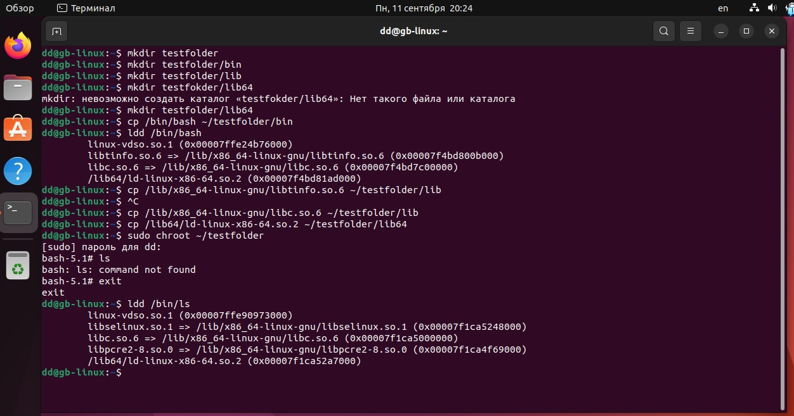
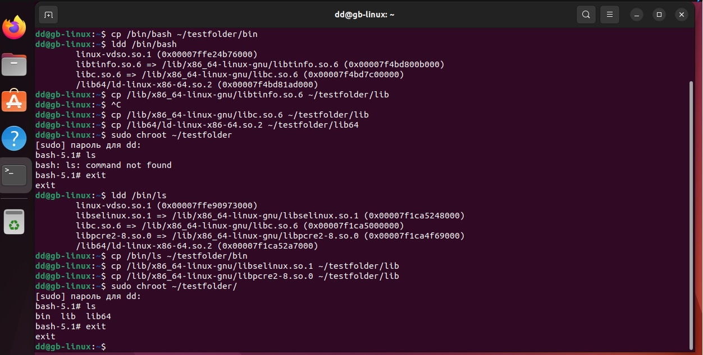
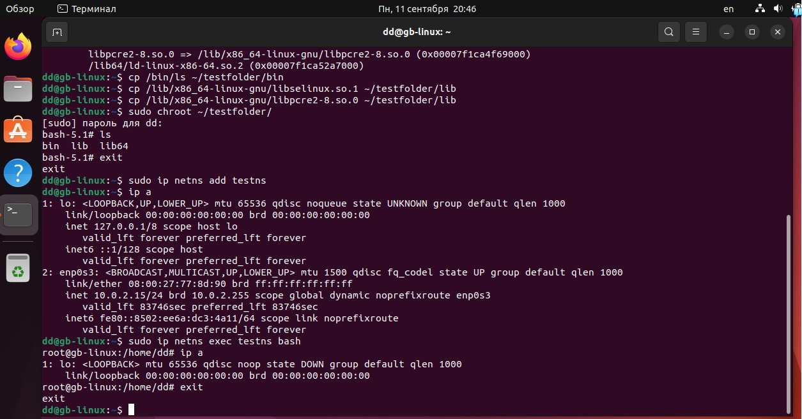
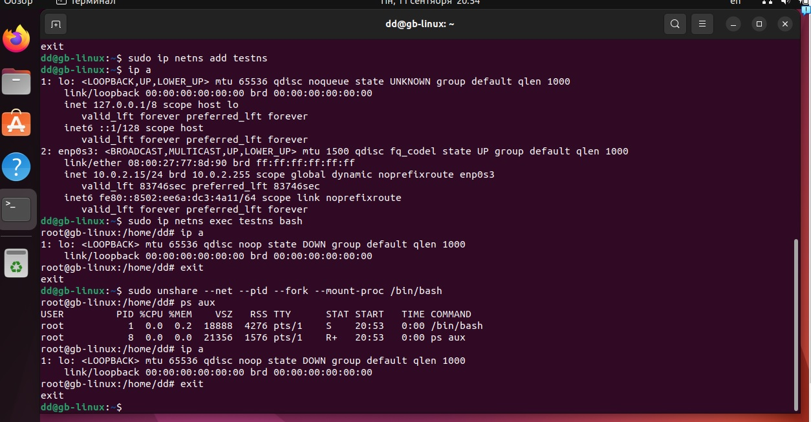

Задание: необходимо продемонстрировать изоляцию одного и того же приложения (как решено на семинаре - командного интерпретатора) в различных пространствах имен.

1. Создаем папку, где будем создавать изолированную среду. В ней также создаем папки, куда будем загружать библиотеки.
2. Создаем папку bin для дальнейшей работы с chroot.
3. С привилегиями суперпользователя(sudo) копируем bin/bash в папку bin (~/testfolder/bin).
6. Копируем библиотеки в созданые папки.
7. Запускаем процесс.
8. Создаем копии библиотек в среде для работы ls. 
9. Проверяем командой ls. 

10. Создаем изолированной сетевое окружение.
11. Запуск процесса. Использование команды ip для просмотра подключений.

12. Глубокая изоляция. В помощью команды создаем изолирваную среду в которой запускается оболочка bash и выполняем команды. 
13. Для проверки работоспособности выполняем команду ps aux. Можно увидеть что команда работает. 

