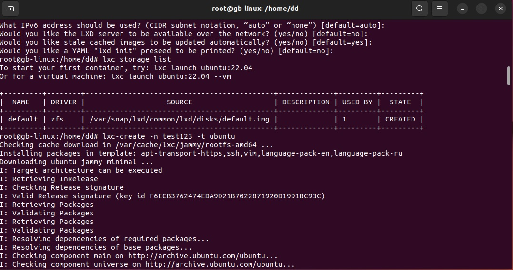
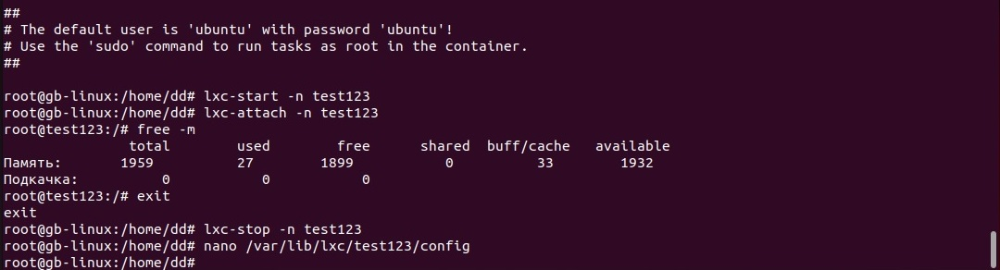
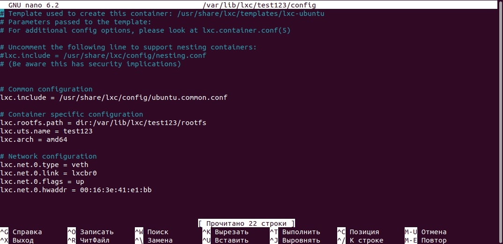
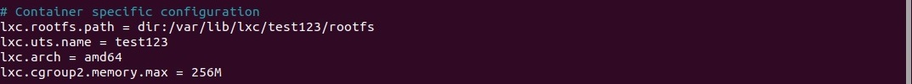
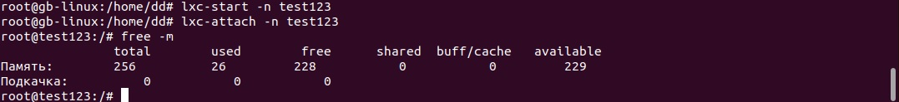

Запустить контейнер с ubuntu, используя механизм LXC
Ограничить контейнер 256 Мб ОЗУ и проверить, что ограничение работает

1. Подгружаем необходимые библиотеки и дополнительные программы
Для этого используем команду 

```
apt-get install lxc debootstrap bridge-utils lxc-templates
apt-get install lxd-installer
```

2. Создаем контейнер 



3. Запускаем и проверяем на доступность памяти
4. Затем закрываем и переходим к редактированию




5. Ограничиваем контейнеру использование памяти 



6. Снова запускаем и проверяем использование памяти 



7. Останавливаем работу контейнера 


