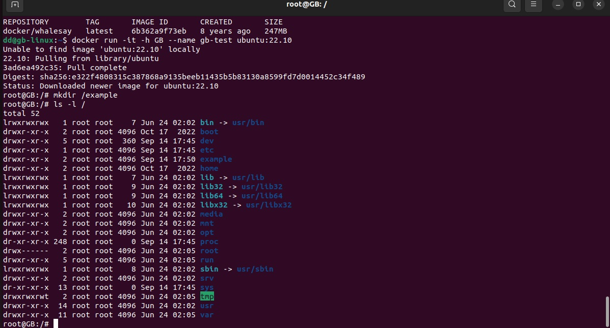
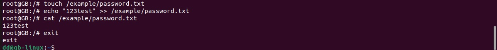
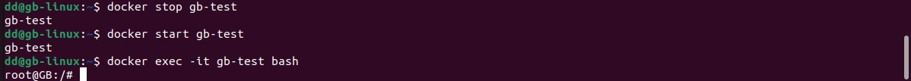
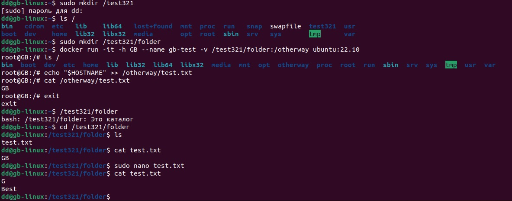
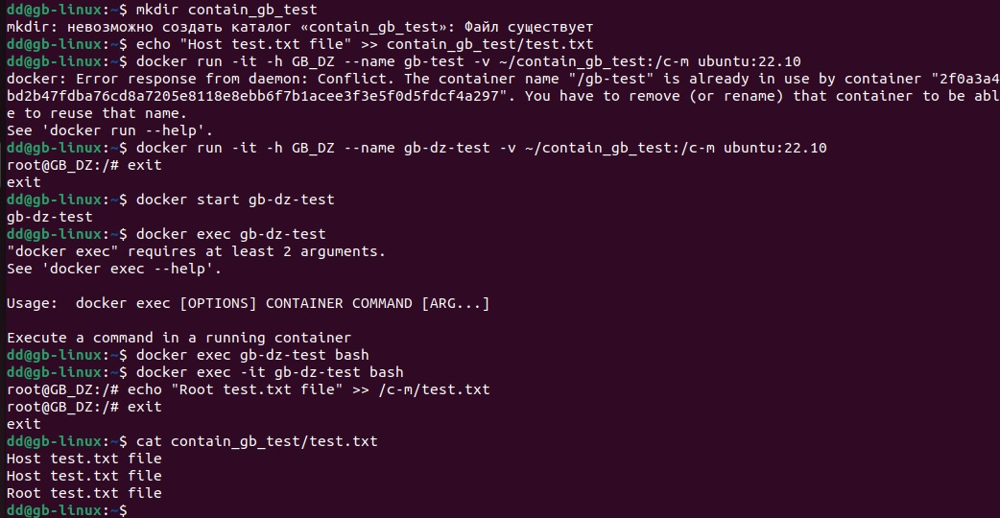

1. Запуск контейнера с использованием образа "cowsay".

2. Тестируем команды docker. Используем такие команды как: удаление, просмотр контейнеров, просмотр образов и т.д.

3. С помощью команды  docker run -it -h GB --name gb-test ubuntu:22.10 запускаем контейнер и входим внего. В нем создаем корневую папку. 
-it - говорит нам о том, что мы сразу туда заходим
-h - название хоста root@GB 
--name - название контейнера 

4. Создаем файл (toch) и перенаправляем его в файл информацию (echo). С помощью команды cat смотрим содержимое файла

5. Для проверки работоспособности останавливаем и снова запускаем докер. С помощью команды exec -it *название докера* *название команды которую хотим в нем запустить*  входим в него. После чего удаляем его 

6. Создаем директорию в корне и в нем папку. Затем монтируем. Для этого мы указываем папку нашей хостовой системы где будут храниться данные контейнера. Затем после *:* которая будет автоматически создана после создании контейнера и которая примотируется к нашй папке. Затем добавляем данные в нашу подмонтированную директорию. 
Затем открываем папку к которой мы все примонтировали. Для этого проваливаем в папку (cd) и смотрим что есть (ls) и смотрим на содержимое. С помощью (nano) изменяем данные и смотрим измениться ли в подмонтированной папке. Для этого с помощью docker exec -it bash входим в контейнер. На этом этапе дополнительно создается контейнер gb-test так как ранее мы его удалили. 

7. Самостоятельно монтируем папки

