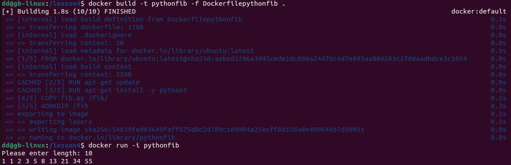

# Создаем папку и в ней dockrfile в котором прописываем команды для создания контейнера 

*Используем базовый образ Ubuntu версии 22.10*

FROM ubuntu:22.10 (можно указать latest)

*Обновляем список пакетов*

RUN apt-get update

*Устанавливаем пакет 'cowsay'*

RUN apt-get install -y cowsay

*Создаем символическую ссылку на 'cowsay'.* 
Нужен обязательно пробел, чтобы мы могла обращаться из любой директории

RUN ln -s /usr/games/cowsay /usr/bin/cowsay

*Очищаем кеш списка пакетов. Делается для того чтобы уменьшить размер файлов*

RUN rm -rf /var/lib/apt/lists/*

*Задаем команду, которая будет выполняться при запуске контейнера*

CMD ["cowsay"]

* Важно не использовать в инструкции cd
* Вместо CMD мы можем использовать ENTRYPOINT и указать путь ["/usr/games/cowsay"] 
после чего при запуске docker run cowsay-image без имени можем сказу писать сообщение для передачи "hi"

После сохранения используем команду для докер сборки.
Соберет образ cowsay*что напишем*, а ( .) *пробел точка* на основе файла и указываем чтобы показать где лежит файл 
Для этого нужно перейти в папку где создали dockerfile

docker build -t cowsay-image .

После выполнения команды запускаем докер контейнер 
docker run cowsay-image cowsay "hi" 

# Создаем и редактируем файлы python app.py и dockerfile1. После редактирования запускаем контейнер docker run 

# Сделаем тоже самое, только теперь пользователь должен ввести в терминал свои данные. Главным отличие является флаг -i, который говорит нам о взаимодействии. 

Находимся в папке в которой хотим создать файл

*Прописываем в файл команду*

sudo nano app.py 

*В новый dockerfile пишем команды*

sudo nano /lesson4/Dockerfile1

*В терминале прописываем команды*

FROM ubuntu:latest
RUN apt-get update && apt-get install -y python3 (можно разделить на 2 команды, -у для подтверждения)

*Чтобы запустить файл его нужно скопировать *

COPY app.py /app/ (что копируем *пробел* куда копируем) 

*Создаем арр*

WORKDIR /app (это рабочая директория контейнера,показывает куда устанавливается, те устанавливает рабочую директорию внутри контейнера) 

CMD ["python3", "app.py"] (мы запускаем программу питон3 и передаем в нее наш код)

*Сохраняем и билдим*

docker build -t mypython -f Dockerfile1 . (-t название контейнера, -f можно использовать докер файлы сохраненые в директории той же) 

*Проверяем работу* 

docker run mypython

* Важный момент, если мы внесем изменения в app.py и запустим просто через run то будут распечатано старое сохранения, чтобы увидеть новое, нам нужно будет делать заново билд но с новым название mypython1
* Если код просит взаимодействие у пользователя (ввести число) то при запуске нужно указывать -i. Это говорит об интерактивности
docker run -i mypython  
* Если ошибся в app.py и при этом контейнер уже создан mypython2, то можно не создавать новый mypython3, а просто перезаписать старый и запустить билд. Тем самый программа перезапишет 

# Самостоятельная работа. Пицем код, для определения числа Фибоначи, изменяем dockerfile.

