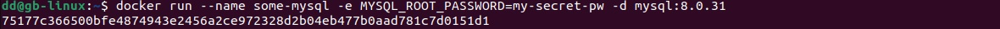
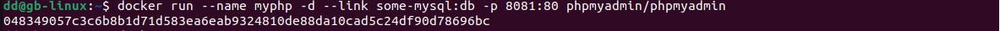
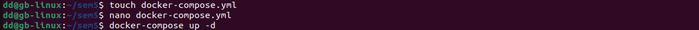
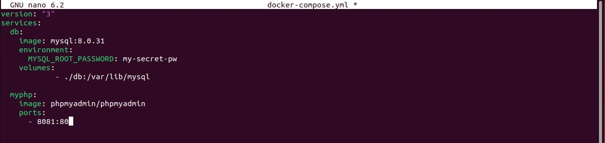
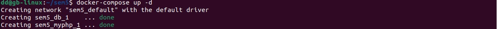
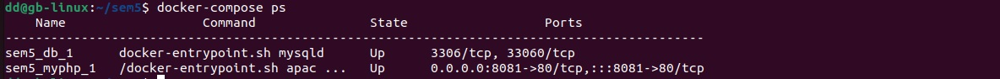
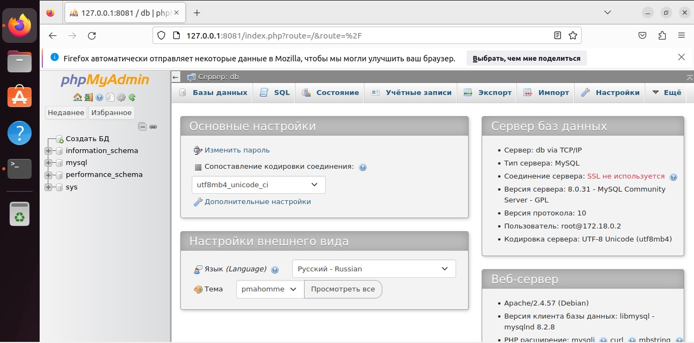

1. Устанавливаем необхотимые утилиты 

2. Создаем директорию и переходим в нее. В ней создаем файл docker-compose с расширением .yml и редактируем его. После редактирования запускаем. Видим на экране done значит все хорошо.  

То что вводим в открывшийся файл: 

Сборка прошла успешна:

3. Просматриваем список всех созданных контейнеров. 

4. Переходим в браузер. В поисковой строке вводим порт 127.0.0.1:8081. Вводим логин и пароль. Успех! 

